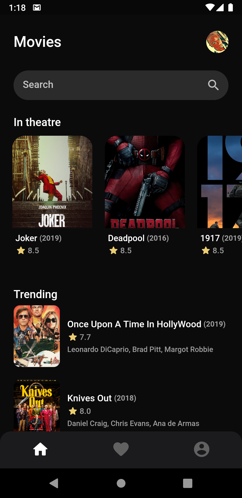
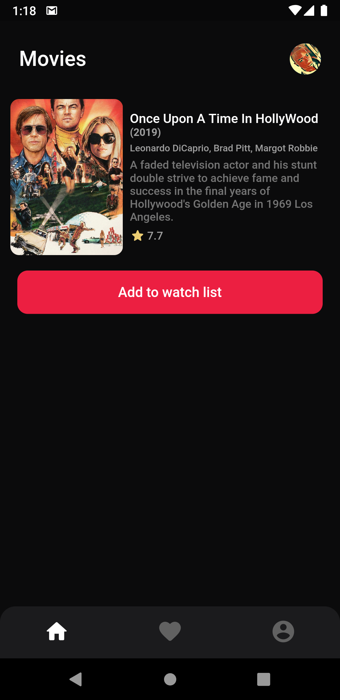

# Movies

Learning Flutter's Declarative UI And Flutter Bloc By Building A Simple Movies App

 

Inspiration from [this dribbble ui design](https://dribbble.com/shots/11105232-Movie-App-UI/attachments/2704740?mode=media)

